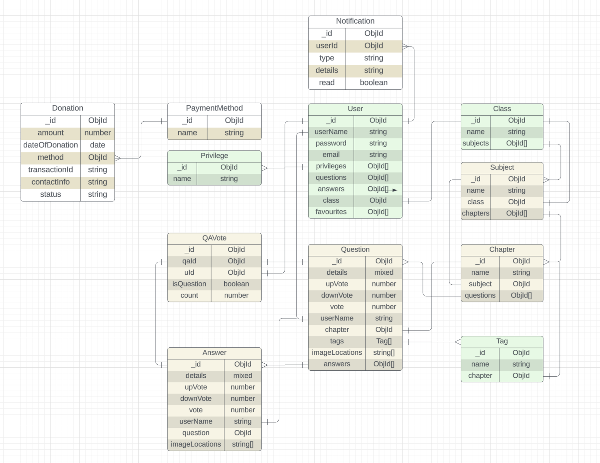

<div align="center">

# Learn Together
<p align="center">
  <a href="https://github.com/rhs99/learn-together/actions">
    
  </a>
  <a href="https://github.com/rhs99/learn-together/actions">
    
  </a>
  <a href="https://github.com/rhs99/learn-together/stargazers">
    
  </a>
  <a href="https://github.com/rhs99/learn-together/issues">
    
  </a>
</p>

### A collaborative knowledge-sharing platform for asking and answering questions on diverse topics

</div>

---

## 📋 Table of Contents

- [Overview](#-overview)
- [Key Features](#-key-features)
- [Technology Stack](#-technology-stack)
- [Architecture](#-architecture)
- [Getting Started](#-getting-started)
- [Development](#-development)
- [Contributing](#-contributing)
- [Roadmap](#-roadmap)

## 🎯 Overview

Learn Together is a modern Q&A platform designed to facilitate knowledge sharing and collaborative learning. Built with performance and user experience in mind, it enables users to ask questions, provide comprehensive answers, and engage with educational content through rich media support including images and mathematical expressions.

### Why Learn Together?

- **Rich Content Support**: Seamlessly integrate images, LaTeX mathematical expressions, and formatted text
- **Real-time Collaboration**: Instant notifications and updates keep the conversation flowing
- **Community-Driven**: Voting system ensures quality content rises to the top

## 🚀 Key Features

### Core Functionality
- ✅ **Question & Answer System** - Post questions and provide detailed answers
- ✅ **Rich Media Support** - Embed images and render complex mathematical equations
- ✅ **Voting Mechanism** - Community-driven quality control through upvotes/downvotes
- ✅ **Bookmarking** - Mark questions as favourite for future reference
- ✅ **Real-time Updates** - WebSocket-powered notifications for instant engagement

### Advanced Features
- 🔍 **Smart Filtering** - Filter by tags, favorites, or authored content
- 📊 **Multiple Sort Options** - Sort by time, vote count, or net votes
- 🔐 **Secure Authentication** - JWT-based authentication system
- 📱 **Responsive Design** - Optimized for all device sizes

## 🛠 Technology Stack

### Frontend
| Technology | Purpose |
|------------|---------|
| **React.js** | UI Framework |
| **TypeScript** | Type Safety |
| **React Context API** | State Management |
| **SCSS** | Styling |
| **Vite** | Build Tool |
| **Optiaxiom** | UI Components |

### Backend
| Technology | Purpose |
|------------|---------|
| **Node.js** | Runtime Environment |
| **Express.js** | Web Framework |
| **JWT** | Authentication |
| **WebSockets** | Real-time Communication |
| **Zod** | Schema Validation |

### Infrastructure
| Technology | Purpose |
|------------|---------|
| **MongoDB** | Primary Database |
| **Redis** | Caching Layer |
| **Docker** | Containerization |
| **Minio** | Object Storage |
| **Docker Compose** | Orchestration |

## 🏗 Architecture

### System Overview

```
┌─────────────────┐     ┌─────────────────┐     ┌─────────────────┐
│                 │     │                 │     │                 │
│  React Client   │────▶│  Express API    │────▶│    MongoDB      │
│                 │     │                 │     │                 │
└─────────────────┘     └─────────────────┘     └─────────────────┘
                                 │                        
                                 │                        
                     ┬───────────┘                       
                     │                                    
              ┌──────▼──────┐                            
              │             │                            
              │   Redis     │                            
              │   Cache     │                            
              │             │                            
              └─────────────┘                            
```

### Database Schema

<div align="center">
  
  
  <p><em>Entity Relationship Diagram showing MongoDB collections and their relationships</em></p>
</div>

## 🚀 Getting Started

### Prerequisites

- [Docker](https://docs.docker.com/get-docker/)
- [Docker Compose](https://docs.docker.com/compose/install/)
- [Git](https://git-scm.com/downloads)

### Quick Start

```bash
# Clone the repository
git clone https://github.com/rhs99/learn-together.git
cd learn-together

# Start all services
docker-compose up -d

# View logs
docker-compose logs -f

# Stop services
docker-compose down
```

The application will be available at:
- **Frontend**: http://localhost:3000
- **API**: http://localhost:5000
- **Minio Console**: http://localhost:9001

### Environment Configuration

Create a `.env` file in the `lt-server` directory:

```env
# Backend Configuration
PORT=5000
SECRET_KEY=your-secret-key

# Database Configuration
MONGODB_URI=mongodb://lt-database:27017/lt-db

# Minio Configuration
MINIO_ENDPOINT=lt-minio
MINIO_PORT=9000
MINIO_ACCESS_KEY=minioadmin
MINIO_SECRET_KEY=minioadmin
```

## 💻 Development

### Code Style

We use ESLint and Prettier for code formatting. Run linting with:

```bash
npm run lint
npm run format
```

## 🤝 Contributing

We welcome contributions!

1. Fork the repository
2. Create your feature branch (`git checkout -b feature/AmazingFeature`)
3. Commit your changes (`git commit -m 'Add some AmazingFeature'`)
4. Push to the branch (`git push origin feature/AmazingFeature`)
5. Open a Pull Request

### Development Guidelines

- Write meaningful commit messages
- Add tests for new features
- Follow the existing code style

## 🗺 Roadmap

### Phase 1: Foundation (Current)
- [x] Core Q&A functionality
- [x] User authentication
- [x] Real-time notifications
- [x] Docker containerization

### Phase 2: Enhancement
- [ ] Comprehensive logging system (ELK Stack)
- [ ] Advanced search capabilities
- [ ] User profiles and reputation system
- [ ] Email notifications

### Phase 3: Scale
- [ ] Migrate to AWS S3 for file storage
- [ ] Implement Nginx reverse proxy
- [ ] Kubernetes deployment
- [ ] CI/CD pipeline (GitHub Actions)

### Phase 4: Advanced Features
- [ ] AI-powered answer suggestions
- [ ] Mobile applications
- [ ] Analytics dashboard

---

<div align="center">

**[Website](https://learn-together.com)** • **[Report Bug](https://github.com/rhs99/learn-together/issues)** • **[Request Feature](https://github.com/rhs99/learn-together/issues)**

</div>
