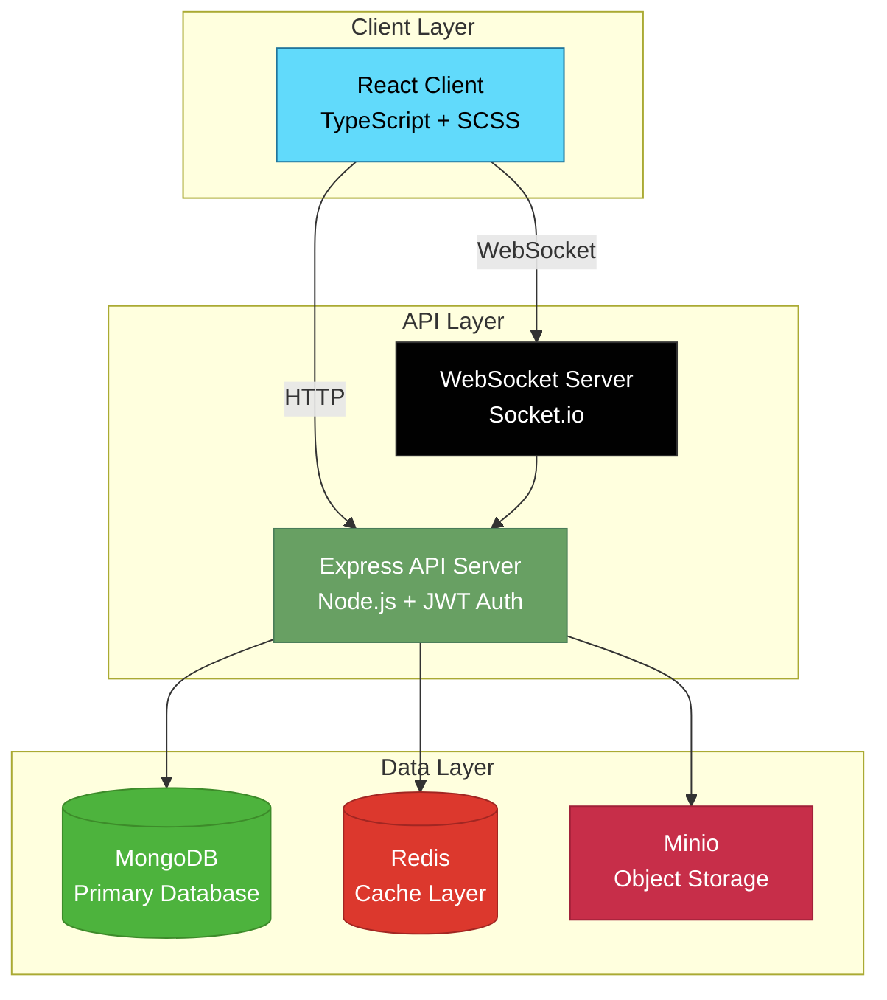
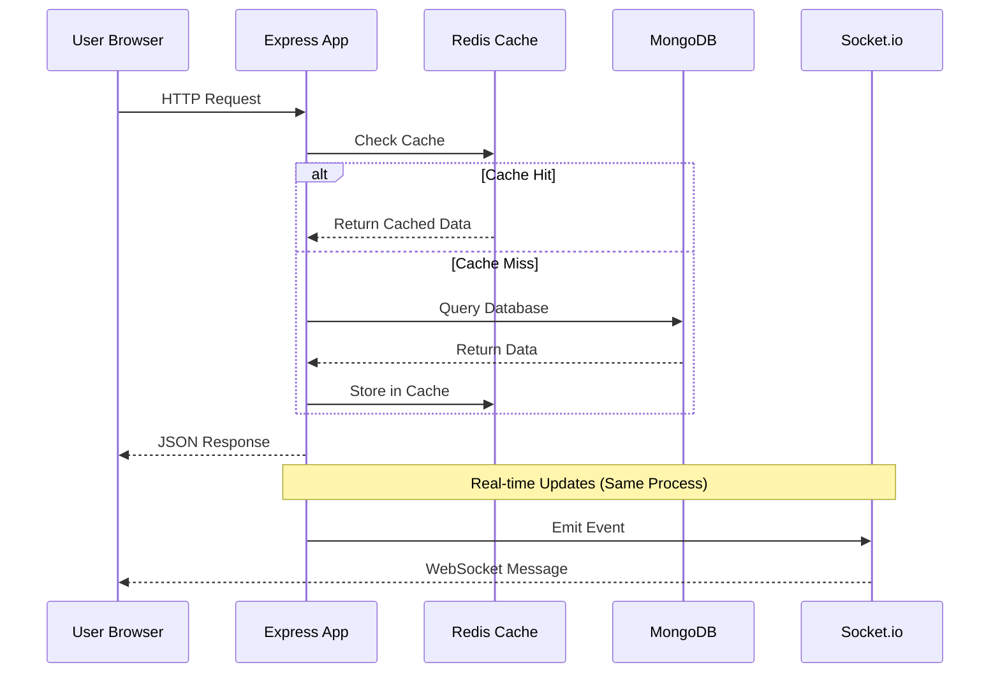
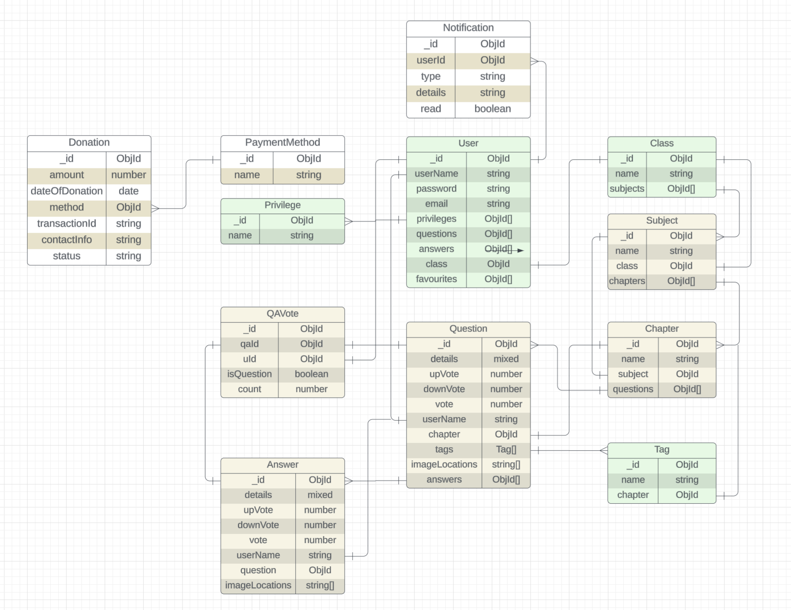

<div align="center">

# Learn Together
<p align="center">
  <a href="https://github.com/rhs99/learn-together/actions">
    
  </a>
  <a href="https://github.com/rhs99/learn-together/actions">
    
  </a>
  <a href="https://github.com/rhs99/learn-together/stargazers">
    
  </a>
  <a href="https://github.com/rhs99/learn-together/issues">
    
  </a>
</p>

### A collaborative knowledge-sharing platform for asking and answering questions on diverse topics

</div>

---

## 📋 Table of Contents

- [🎯 Overview](#-overview)
- [🚀 Key Features](#-key-features)
  - [Core Platform Features](#core-platform-features)
  - [Advanced Capabilities](#advanced-capabilities)
- [🏗 Architecture](#-architecture)
  - [System Overview](#system-overview)
  - [📊 Data Flow Architecture](#-data-flow-architecture)
  - [Database Schema](#database-schema)
- [🛠 Technology Stack](#-technology-stack)
  - [Frontend](#frontend)
  - [Backend](#backend)
  - [Infrastructure](#infrastructure)
- [🚀 Getting Started](#-getting-started)
  - [Prerequisites](#prerequisites)
  - [Quick Start](#quick-start)
  - [Environment Configuration](#environment-configuration)
- [🤝 Contributing](#-contributing)
  - [Development Guidelines](#development-guidelines)
- [🗺 Roadmap](#-roadmap)
  - [Phase 1: Foundation ✅](#phase-1-foundation-)
  - [Phase 2: Advanced Features (Upcoming)](#phase-2-advanced-features-upcoming)

## 🎯 Overview

Learn Together is a modern collaborative Q&A platform that facilitates knowledge sharing and learning through an intuitive, feature-rich interface. Built with performance and scalability in mind, it empowers users to ask questions, provide comprehensive answers, and engage with educational content seamlessly.

## 🚀 Key Features

### Core Platform Features
- ✅ **Question & Answer System** - Post detailed questions and provide comprehensive answers
- ✅ **Rich Media Integration** - Support for images, mathematical equations, and formatted content
- ✅ **Community Voting** - Upvote/downvote system for quality-driven content curation
- ✅ **Personal Bookmarks** - Save favorite questions for easy future reference
- ✅ **Real-time Notifications** - WebSocket-powered instant updates and engagement alerts

### Advanced Capabilities
- 🔍 **Smart Content Filtering** - Filter by tags, favorites, authorship, and custom criteria
- 📊 **Flexible Sorting Options** - Sort by creation date, vote count, or net popularity
- 🔐 **Secure Authentication** - JWT-based user authentication and session management
- 📱 **Responsive Design** - Fully optimized experience across all devices and screen sizes

## 🏗 Architecture

### System Overview


```mermaid
graph TB
  subgraph "Client Layer"
    RC[React Client<br/>TypeScript + SCSS]
  end
  
  subgraph "API Layer"
    EA[Express API Server<br/>Node.js + JWT Auth]
    WS[WebSocket Server<br/>Socket.io]
  end
  
  subgraph "Data Layer"
    MDB[(MongoDB<br/>Primary Database)]
    RDS[(Redis<br/>Cache Layer)]
    MIN[Minio<br/>Object Storage]
  end
  
  RC -->|HTTP| EA
  RC -->|WebSocket| WS
  EA --> MDB
  EA --> RDS
  EA --> MIN
  WS --> EA
  
  style RC fill:#61dafb,stroke:#21759b,color:#000
  style EA fill:#68a063,stroke:#4a7c59,color:#fff
  style WS fill:#010101,stroke:#333,color:#fff
  style MDB fill:#4db33d,stroke:#3d8b2a,color:#fff
  style RDS fill:#dc382d,stroke:#a12622,color:#fff
  style MIN fill:#c72e49,stroke:#a02139,color:#fff
```

### 📊 Data Flow Architecture


```mermaid
sequenceDiagram
    participant U as User Browser
    participant A as Express App
    participant R as Redis Cache
    participant M as MongoDB
    participant S as Socket.io
    
    U->>A: HTTP Request
    A->>R: Check Cache
    alt Cache Hit
        R-->>A: Return Cached Data
    else Cache Miss
        A->>M: Query Database
        M-->>A: Return Data
        A->>R: Store in Cache
    end
    A-->>U: JSON Response
    
    Note over A,S: Real-time Updates (Same Process)
    A->>S: Emit Event
    S-->>U: WebSocket Message
```

### Database Schema

<div align="center">
  
  
  <p><em>Entity Relationship Diagram showing MongoDB collections and their relationships</em></p>
</div>

## 🛠 Technology Stack

| Category | Technology |
|----------|------------|
| **Frontend** | React.js, TypeScript, SCSS, Vite, Optiaxiom, React Context API |
| **Backend** | Node.js, Express.js, JWT, WebSockets, Zod |
| **Infrastructure** | MongoDB, Redis, Docker, Minio |


## 🚀 Getting Started

### Prerequisites

- [Docker](https://docs.docker.com/get-docker/)
- [Docker Compose](https://docs.docker.com/compose/install/)
- [Git](https://git-scm.com/downloads)

### Quick Start

```bash
# Clone the repository
git clone https://github.com/rhs99/learn-together.git
cd learn-together

# Start all services
docker-compose up -d

# View logs
docker-compose logs -f

# Stop services
docker-compose down
```

The application will be available at:
- **Frontend**: http://localhost:3000
- **API**: http://localhost:5000

### Environment Configuration

Create a `.env` file in the `lt-server` directory:

```env
# Backend Configuration
PORT=5000
SECRET_KEY=your-secret-key

# Database Configuration
MONGODB_URI=mongodb://lt-database:27017/lt-db

# Minio Configuration
MINIO_ENDPOINT=lt-minio
MINIO_PORT=9000
MINIO_ACCESS_KEY=minioadmin
MINIO_SECRET_KEY=minioadmin
```

## 🤝 Contributing

We welcome contributions!

1. Fork the repository
2. Create your feature branch (`git checkout -b feature/AmazingFeature`)
3. Commit your changes (`git commit -m 'Add some AmazingFeature'`)
4. Push to the branch (`git push origin feature/AmazingFeature`)
5. Open a Pull Request

### Development Guidelines

- Write meaningful commit messages
- Add tests for new features
- Follow the existing code style

## 🗺 Roadmap

### Phase 1: Foundation ✅
- [x] **Core Q&A Platform** - Complete question and answer functionality with rich text support
- [x] **User Authentication** - Secure JWT-based authentication and authorization system
- [x] **Real-time Communication** - WebSocket-powered notifications and live updates
- [x] **Performance Optimization** - Redis caching layer for enhanced response times
- [x] **Data Validation** - Robust request validation using Zod schema validation
- [x] **Comprehensive Testing** - Unit and integration test suites for backend services
- [x] **Structured Logging** - Production-ready logging system implemented with Winston
- [x] **Containerization** - Docker-based deployment configuration for all services
- [x] **Automated CI/CD** - GitHub Actions pipeline for continuous integration and testing

### Phase 2: Advanced Features (Upcoming)
- [ ] **AI Integration** - AI-powered answer suggestions and content recommendations
- [ ] **Analytics & Insights** - Comprehensive analytics dashboard for user engagement metrics

---

<div align="center">

**[Website](https://learn-together.com)** • **[Report Bug](https://github.com/rhs99/learn-together/issues)** • **[Request Feature](https://github.com/rhs99/learn-together/issues)**

</div>
